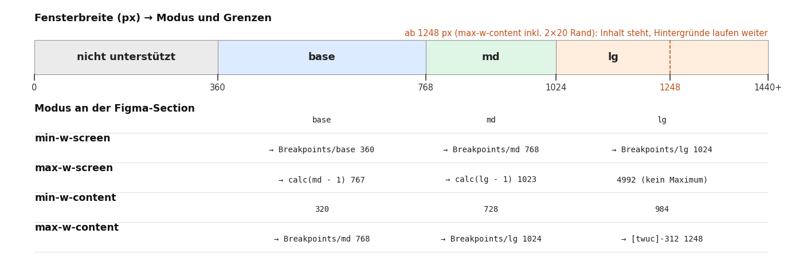
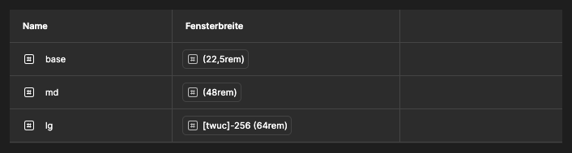
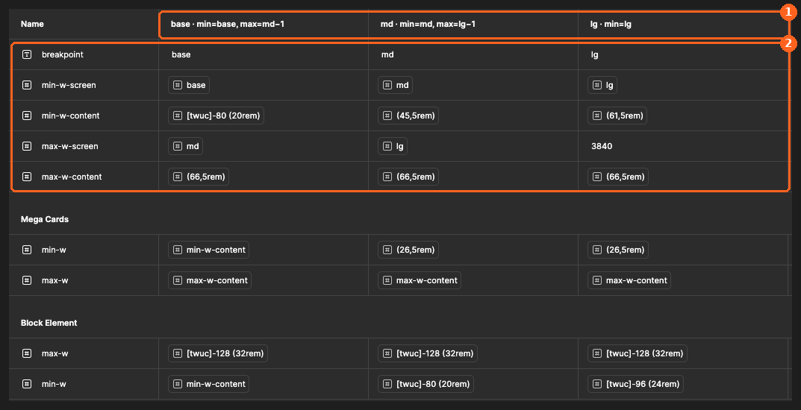
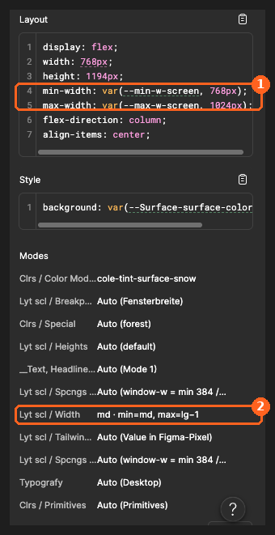
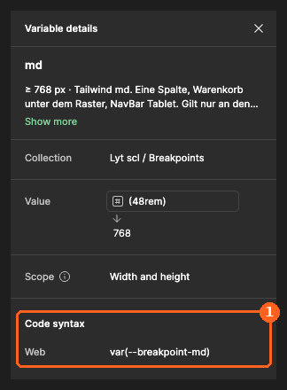
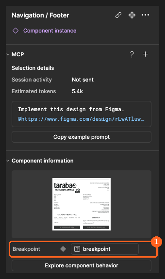

# 2.5 Breakpoints und Width-Variablen

Stand: 25.09.2026 (Seitenmodell mit einer Variante) · Figma-Datei „B2C und CI“, Seite COMPONENTS & SCREENS

Dieses Kapitel erklärt, wie die Breiten im Figma-File mit den Breakpoints zusammenhängen, wie Du sie in Figma abliest und wie Du sie in Tailwind umsetzt.



## Grundkonzept

Ein **Breakpoint** sei eine Schwelle der Fensterbreite (360 · 768 · 1024 px). Ein **Breitenbereich** sei die Spanne zwischen zwei Breakpoints (`base` 360–767 · `md` 768–1023 · `lg` ab 1024). Das responsive Verhalten hängt am Breitenbereich: In jedem Breitenbereich gilt ein Modus von `Lyt scl / Width`. Ab 1248 px bleibt der Inhalt stehen und wird zentriert. Das ist kein Breakpoint, sondern die Inhaltsbreite im Breitenbereich `lg` (`max-w-content`).

## Das Prinzip in drei Sätzen

1. **Der Modus der Variablen wird an der Seite festgelegt:** so simuliert die Designerin in Figma die Auswahl des entsprechenden Breitenbereichs. [Templates / Page](https://www.figma.com/design/rLwATluwV4CSS5rXceLptH/B2C-und-CI?node-id=8358-53818&m=dev) hat nur eine Variante und passt sich selbst an die Breite an. Den Modus von `Lyt scl / Width` setzt die Designerin an der Section um die Seite oder an der Instanz der Seite. Figma wendet für jede Komponente darin den passenden Modus an und rendert `min-width: var(…)` und `max-width: var(…)` entsprechend.
2. **Die Werte „hängen“ am Modus, manche Werte ändern sich je nach Modus.** Eine Komponente auf einer md-Seite rechnet deshalb mit den md-Werten.
3. **Komponenten schalten mit.** Footer, NavBar, Nav, PromoBar und Nutmixer haben eine Property `Breakpoint`. Sie ist an die Text-Variable `viewport-range` gebunden und wählt die Variante, die zum Breitenbereich der Seite passt.

## Die drei Collections

| Collection | Inhalt | Modi | Im Code |
| --- | --- | --- | --- |
| `Lyt scl / Breakpoints` | `base` 360 · `md` 768 · `lg` 1024, dazu `calc(md - 1)` 767 · `calc(lg - 1)` 1023 | einer („Values“) | `--breakpoint-md: 48rem`, `--breakpoint-lg: 64rem`. `--breakpoint-*: initial` entfernt die Tailwind-Standards `sm`, `xl`, `2xl`. `base` hat keine Media-Query. |
| `Lyt scl / Width` | alle Element-Breiten (min-w, max-w) plus die Seitengrenzen | `base` · `md` · `lg` | `--container-*`-Tokens, die `:root` je Breakpoint neu setzt (siehe unten) |
| `Lyt scl / Tailwind-utility-units` | Primitive in rem, z. B. `[twuc]-96 (24rem)` | einer | nur Quelle für Aliase, im Code die eingebaute Tailwind-Skala |

Breakpoints stehen in einer eigenen Collection, weil sie Schwellen der Fensterbreite sind und keine Maße eines Elements.



## Die Seitengrenzen in `Lyt scl / Width`

| Variable | base | md | lg | Zweck |
| --- | --- | --- | --- | --- |
| `viewport-range` | „base“ | „md“ | „lg“ | schaltet die Varianten eingebetteter Komponenten |
| `min-w-screen` | → Breakpoints/base (360) | → Breakpoints/md (768) | → Breakpoints/lg (1024) | untere Grenze der Seite |
| `max-w-screen` | → Breakpoints/calc(md - 1) (767) | → Breakpoints/calc(lg - 1) (1023) | 4992 | obere Grenze der Seite. 4992 ist ein Platzhalter, da lg kein Maximum hat. |
| `min-w-content` | 320 | 728 | 984 | kleinste Inhaltsbreite (Fenster − 2 × 20 Rand). Kein min-w eines Elements darf darüber liegen. |
| `max-w-content` | → Breakpoints/md (768) | → Breakpoints/lg (1024) | → `[twuc]-312 (78rem)` (1248) | größte Breite der Ebene „Wrapper [max-w-content]“ inklusive 2 × 20 px Rand. Ab 1248 px Fenster steht der Inhalt (1208 px) und wird zentriert. |



## Variablen, die es nur in Figma gibt

Diese Variablen steuern die Simulation in Figma. Im Code haben sie kein Gegenstück, und Du übernimmst sie nicht aus dem Dev Mode:

| Variable | Warum nur Figma | Im Code |
| --- | --- | --- |
| `Lyt scl / Breakpoints` › md, lg | Eine Media-Query kann keine Variable lesen (`@media (min-width: var(--x))` ist ungültig). Die Code-Syntax `var(--breakpoint-md)` nennt das Token, sie ist kein Code zum Einfügen. | Varianten `md:` und `lg:` (und `max-md:`, `max-lg:`). In eigenem CSS: `@variant md { … }` |
| `Lyt scl / Breakpoints` › base, calc(md - 1), calc(lg - 1) | bilden in Figma die Grenzen der Seite nach. Keine Code-Syntax, Beschreibung „Nur Figma“. | `max-md:` / `max-lg:` |
| `min-w-screen`, `max-w-screen` | simulieren die Grenzen der Seite an `Templates / Page`. Der Dev Mode zeigt sie als `min-width: var(--min-w-screen, …)` bzw. `max-width: var(--max-w-screen, …)`. | entfällt, die Seite ist der Viewport |
| `viewport-range` (Text) | schaltet in Figma die Varianten der Komponenten | entfällt, die Komponente nutzt responsive Klassen |
| `visible-md-up` (Boolean) | blendet Ebenen im Breitenbereich base aus | `hidden md:block` (bzw. `md:flex`) |
| `Lyt scl / Tailwind-utility-units` | Rohwerte, aus denen die Breiten gespeist werden | eingebaute Tailwind-Skala |
| `Lyt scl / Spcngs / Gaps` | identisch mit Box Spacing | beide Collections ergeben eine `--spacing-*`-Skala |

`min-w-content` ist vor allem eine Designregel und die Quelle für die base-Werte anderer Breiten. Im Code kann es als Token bleiben, auf das andere Tokens verweisen.

## So liest Du Breakpoints und Breiten in Figma manuell aus

### Welcher Modus gilt für die Seite?

Im Layers-Panel zeigen die Chips neben der Section und neben der Instanz von `Templates / Page` den gepinnten Modus. Im **Dev Mode** zeigt das Inspect-Panel unter **Layout** die Grenzen und unter **Modes** den aktiven Modus:



① `min-width: var(--min-w-screen, 768px)` und `max-width: var(--max-w-screen, 1024px)` zeigen den Bereich dieser Seite: 768 bis 1023 px, also Tailwind `md`.
② Unter **Modes** steht bei `Lyt scl / Width` der aktive Modus. Alle Breiten dieser Seite und ihrer Komponenten kommen aus diesem Modus.

### Welcher CSS-Name gehört zu einem Breakpoint?



① Unter **Code syntax → Web** steht der Name des Tokens, hier `--breakpoint-md`. Er legt nur fest, ab welcher Breite die Variante `md` greift.

Auch die Width-Variablen tragen unter **Code syntax → Web** den Token-Namen aus `app.tcss`, z. B. `Block Element/min-w` → `var(--container-block-min)`, Klasse `min-w-block-min`. Variablen, die es nur in Figma gibt, haben keine Code-Syntax, sondern den Hinweis „Nur Figma“ in der Beschreibung. Alle Namen: Tabelle in [2.3](2.3-design-tokens-tailwind-v4.md).

### Warum sieht eine Komponente je Seite anders aus?



① Die Property `Breakpoint` zeigt kein festes „md“, sondern die Variable `viewport-range` (im Bild noch unter ihrem alten Namen `breakpoint`). Der Footer übernimmt damit die Variante des Modus, in dem er liegt. Im Code braucht er dafür keine Prop.

## Anwendung in Tailwind CSS

Breiten, die sich je Breitenbereich unterscheiden, werden wie in Figma an einer höheren Ebene gepinnt. In Figma übernimmt das der Modus an der Section oder Seite, im CSS übernimmt es `:root`: Das Token steht einmal mit dem base-Wert und wird ab jedem Breakpoint neu gesetzt.

```css
@theme {
  --breakpoint-*: initial;        /* nur md und lg, wie in Figma */
  --breakpoint-md: 48rem;         /* Figma-Variable: Lyt scl / Breakpoints › md */
  --breakpoint-lg: 64rem;         /* Figma-Variable: Lyt scl / Breakpoints › lg */
  --container-block-min: 20rem;   /* Figma-Variable: Lyt scl / Width › Block Element/min-w, base */
}
:root {
  --content-max: 48rem;           /* Figma-Variable: Lyt scl / Width › max-w-content, base */
  @variant md { --container-block-min: 20rem; --content-max: 64rem; }
  @variant lg { --container-block-min: 24rem; --content-max: 78rem; }
}
@utility max-w-content { max-width: var(--content-max); }
```

Die Komponente braucht dann nur eine Klasse und keine spezifischen Angaben je Breitenbereich:

```html
<section>                                         <!-- Figma-Komponente „Section“ -->
  <div class="mx-auto max-w-content px-5">         <!-- Figma-Ebene „Wrapper [max-w-content]“ -->
    <div class="max-w-block-max min-w-block-min">  <!-- Figma-Komponente „Block Element“ -->
```

| Figma | Code |
| --- | --- |
| Width-Variable mit gleichem Wert in allen Modi, z. B. `Block Element/max-w` = 512 | ein Token in `@theme`, eine Klasse: `max-w-block-max` |
| Width-Variable mit Werten je Modus, z. B. `Block Element/min-w` = 320 · 320 · 384 | ein Token, das `:root` ab `md` und `lg` neu setzt, eine Klasse: `min-w-block-min` |
| `max-w-content` in der Ebene „Wrapper [max-w-content]“ | `mx-auto max-w-content px-5` im inneren Container, Hintergrund auf der Section |
| Komponente mit `Breakpoint`-Varianten | eine Komponente ohne Breakpoint-Prop; was sich außer den Breiten ändert (Spalten, Abstände, Reihenfolge), mit `md:` und `lg:` |

Tailwind v4 macht aus jedem `--container-*`-Token die Klassen `w-`, `min-w-` und `max-w-`. `min-w-content` und `max-w-content` sind eigene `@utility` mit genau den Figma-Namen. Ein Token `--container-content` erzeugte auch `min-w-content`, und zwar mit dem Maximalwert. Mit Tailwind 4.3.3 geprüft.

## Regeln für Design und Pflege

- **Die Seite hat eine Variante.** `Templates / Page` passt sich selbst an die Breite an. Varianten je Breitenbereich braucht die Seite nicht.
- **Der Modus sitzt außen.** Den Breitenbereich wählst Du über den Modus von `Lyt scl / Width` an der Section um die Seite oder an der Instanz der Seite. Die Vorlage pinnt selbst keinen Modus. Ohne Pin gilt der Standardmodus der Collection.
- **Grenzen nur am Seitenrahmen.** Nur `Templates / Page` bindet die Seitengrenzen aus `Lyt scl / Width`. `Pages / …` wie ProductPage tragen keine eigenen Grenzen.
- **Komponenten pinnen keinen Modus.** Eine Instanz übernimmt den Pin ihres Masters: Hätte `Sections / Tabs / SectionTabs` einen base-Pin, rechnete sie auch auf lg-Seiten mit base-Werten (so am 24.09. behoben).
- **Varianten je Breitenbereich schalten über `viewport-range`.** Komponenten mit Varianten je Breitenbereich (NavBar, Nav, PromoBar, Footer, Nutmixer) binden ihre Property `Breakpoint` an `viewport-range`.
- **Breite und Modus gehören zusammen.** Figma wählt den Modus nicht nach der Breite. Eine Seite mit 1248 px braucht den Modus lg.
- **Kein min-w über `min-w-content`.** Sonst läuft das Element im kleinsten Breitenbereich über.
- **Hintergrund volle Breite, Inhalt begrenzt.** Sections laufen bis zum Fensterrand. Der Inhalt begrenzt sich in der Ebene „Wrapper [max-w-content]“ (max-w-content inklusive 20 px Rand).
- **Layout-Wrapper heißen nach ihrer Klasse:** `Wrapper [klasse]`, z. B. „Wrapper [max-w-content]“.
- **Figma kann nicht rechnen.** Ändert sich ein Breakpoint, musst Du die abhängigen Werte von Hand mitändern: `min-w-content` (base) = base − 40, `calc(md - 1)` = md − 1, `calc(lg - 1)` = lg − 1.
