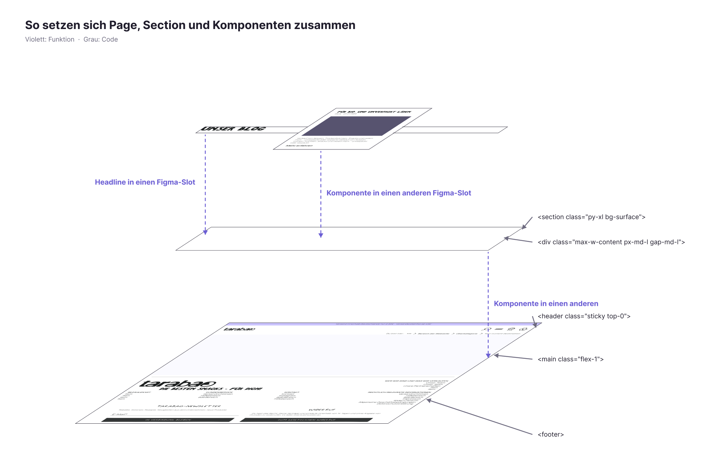

# 2.7 Layout: So bauen sich Page, Section und Komponenten auf

Figma-Datei „B2C und CI“, Seite COMPONENTS & SCREENS · Vorlagen `Templates / Page` (Set 8358:53818) und `Templates / Section` (Set 8308:40715)



Die Seite besteht aus drei Ebenen. Komponenten wie `Primitives / Headline / H1` oder `Templates / Cards Order` gehen in die Slots der Section. Sections gehen in den Section-Slot der Page. Nur der Bildschirm scrollt, die Seite selbst hat keinen eigenen Scroll-Bereich.

Klassen stehen immer in zwei Schreibweisen: zuerst die Klasse aus unserem Designsystem (`app.tcss`), dahinter in Klammern die Tailwind-Standardklasse.

---

## So baut die Designerin die Seite in Figma

```
Templates / Page   (Hug, Min-Höhe = Bildschirm)
├─ Header          (Sticky)
├─ main            (Hug, Fill-Breite)
│   └─ Sections    → Section-Slot
└─ Footer          (Fill-Breite)
```

1. **Die Seite wächst mit dem Inhalt.** Die Höhe steht auf Hug, die Min-Höhe auf der Bildschirmhöhe (792). Eine feste Höhe gibt es nicht, damit die ganze Seite auf dem Canvas sichtbar bleibt.
2. **Nur der Bildschirm scrollt.** Die Wurzel von `Templates / Page` steht für das Browserfenster. Nur sie hat Overflow (vertikal), damit der responsive Prototyp scrollt. `main`, die Sections und ihre Inhalte haben keinen Overflow. Einen eigenen Scroll-Bereich bekommen nur Teile, die unabhängig scrollen: ein Modal, ein Filter-Panel oder ein horizontales Karussell.
3. **Header, main und Footer sind Geschwister.** Der Footer liegt nicht in `main`.
4. **Der Header ist sticky.** Unter Position steht „Sticky“.
5. **Die Breite kommt über Fill.** Sections und Footer füllen die Breite, und `Wrapper [max-w-content]` begrenzt den Inhalt.
6. **Inhalte kommen in Slots.** Eine Komponente liegt immer in einem Slot der Section (Breadcrumps, ContentSlot 01 … 05), eine Section immer im Section-Slot der Page. Leere Slots blendest Du aus, die Breadcrumb der Section über die Property „Display Breadcrumps“.
7. **Den Bildschirm legt das Device fest.** Die Bildschirmgröße wählst Du im Prototyp-Panel. Ist die Seite höher als das Device, scrollt der Prototyp von selbst.
8. **Den Breitenbereich legt die Figma-Section fest, in der die Seite liegt.** Details: [2.5](2.5-breakpoints-und-width.md).
9. **Nach Änderungen prüfst Du die Höhe.** Springt eine Seite oder ein Slot auf eine feste Höhe, stellst Du ihn wieder auf Hug.

### So entstehen die Abstände

| Figma-Ebene | HTML | Padding vertikal | Padding horizontal | Gap |
|---|---|---|---|---|
| **Page** (`main` → Section-Slot) | `<main>`, stapelt Sections | 0 | 0 | 0 |
| **Section** (Instanz von `Templates / Section`) | `<section>`, Hintergrund volle Breite | 40 | 0 | 0 |
| **Wrapper [max-w-content]** | `<div>` im `<section>` | 0 | 20 | 20 |
| **Content Slot** | kein Element, Inhalte folgen direkt | 0 | 0 | 0 |
| **Inhalt mit mehreren Kindern** (z. B. Card-Reihe) | eigene Komponente mit eigenem Gap | 0 | 0 | 12 (Horizontal Scroll: 16) |
| **Inhalt mit einem Kind** (z. B. Headline / H2) | eigene Komponente | 0 | 0 | 0 |

1. **Vertikaler Abstand entsteht nur an der Section** (40 oben und unten, Gap 0). Zwischen zwei Sections liegen damit 80 px, die Page fügt nichts hinzu.
2. **Der seitliche Rand sitzt im Wrapper** (20), damit der Hintergrund der Section bis zum Fensterrand läuft.
3. **Der Gap im Wrapper (20) ist der einzige Abstand zwischen mehreren Inhaltsblöcken einer Section.**
4. **Slots und die Page-Kette tragen keinen Abstand.** Sie transportieren nur.
5. **Inhaltskomponenten bringen ihren inneren Abstand selbst mit.**
6. **Ein Container mit nur einem Kind hat Gap 0.**

### So bindest Du Abstände in Figma

- **Auch `0` wird gebunden — nicht als nackte 0 belassen:** Gap = 0 bevorzugt an `gap-zero`, Padding = 0 an `box-spacing-zero` (beide aliasen `[twuc]-0 (0rem)`). So ist auch „bewusst kein Abstand" explizit als Design-Entscheidung sichtbar.
- **Wirkungslose Gaps** werden auf 0 gesetzt und an `gap-zero` gebunden: Ein `itemSpacing` wirkt nur zwischen ≥ 2 Kindern — ist ein Auto-Layout-Frame mit weniger als 2 Kindern (ausgeblendete Elemente mitgezählt, da sie sichtbar werden könnten), ist der Gap tot. `counterAxisSpacing` auf Frames ohne `layoutWrap: WRAP` bleibt unangetastet (latente Property, kein sichtbarer Gap — kein Rauschen erzeugen).
- **Ungebundene Abstände auf Component-Set-Rahmen und Canvas-Ordnungsframes sind Absicht.** Nur innerhalb von Varianten ist ein ungebundener Abstand ein Fehler.

Warum es getrennte Collections für Box Spacing und Gaps gibt: [2.6 Design-Tokens §5](2.6-design-tokens-tailwind-v4.md).

---

## So setzt der Webentwickler die Seite mit Dev Mode und Code um

### So liest Du die Seite in Dev Mode

1. Der KI-Agent / der Entwickler übernimmt die Höhe der Seite aus Figma nicht. Sie wird dynamisch über die Klasse `min-h-dvh` berechnet.
2. **Die Seite scrollt als Ganzes.** Der KI-Agent / der Entwickler baut keinen inneren Scroll-Container, also kein `overflow-y: auto` mit fester Höhe an `main` oder den Sections. Den Overflow an der Wurzel von `Templates / Page` übernimmt er nicht, er simuliert in Figma nur das Browserfenster.
3. **Slots bekommen kein Element.** Die Inhalte eines Slots folgen direkt im Wrapper. Min-Höhe und Fläche eines leeren Slots sind Platzhalter in Figma.
4. **Die Werte liest Du aus den Variablen.** Die Code-Syntax WEB zeigt `var(--…)`. Da `app.tcss` diese Variablen anlegt, gibt es passende Klassen: `--spacing-xl` → `py-xl`, `--content-max` → `max-w-content`.
5. **Der Name `Wrapper [klasse]` nennt die Klasse**, die diese Ebene braucht.
6. **`main.flex-1` ergänzt Du selbst.** So bleibt der Footer bei kurzem Inhalt unten. Figma bildet das nicht ab.

### So sieht `Templates / Page` in Tailwind aus

```html
<body class="flex min-h-dvh min-w-content flex-col items-center bg-surface">
  <!-- (min-w-80 md:min-w-182 lg:min-w-246, wenn das Designsystem nicht vollständig aktualisiert worden sein sollte) -->
  <header class="sticky top-0 z-50 flex w-full flex-col items-center bg-surface">…</header>

  <main class="flex w-full flex-1 flex-col items-center">
    <nav aria-label="Breadcrumb" class="flex h-5 w-full items-center justify-center gap-3 px-md-l">…</nav>
    <!-- (px-5, wenn das Designsystem nicht vollständig aktualisiert worden sein sollte) -->
    <!-- Section-Slot: Sections folgen direkt, ohne eigenes Element -->
  </main>

  <footer class="flex w-full flex-col items-center justify-center bg-surface py-md-l">…</footer>
  <!-- (py-5, wenn das Designsystem nicht vollständig aktualisiert worden sein sollte) -->
</body>
```

| Figma | Variable (WEB) | Tailwind |
|---|---|---|
| Page min-w | `var(--content-min)` | `min-w-content` (`min-w-80 md:min-w-182 lg:min-w-246`, wenn das Designsystem nicht vollständig aktualisiert worden sein sollte) |
| Page min-h 792 | keine Variable (Viewport) | `min-h-dvh` |
| Fill Page, Header, Footer | `var(--surface-color)` | `bg-surface` |
| Footer padding oben/unten | `var(--spacing-md-l)` | `py-md-l` (`py-5`, wenn das Designsystem nicht vollständig aktualisiert worden sein sollte) |
| Breadcrumb px | `var(--spacing-md-l)` | `px-md-l` (`px-5`, wenn das Designsystem nicht vollständig aktualisiert worden sein sollte) |
| Breadcrumb gap / Höhe | `calc(var(--spacing) * 3)` / `* 5` | `gap-3` / `h-5` |
| max-w-screen | nur Figma | – |
| gap / padding `…-zero` | `var(--spacing-zero)` | keine Klasse nötig |

### So sieht `Templates / Section` in Tailwind aus

```html
<section class="flex w-full flex-col items-center bg-surface py-xl">
  <!-- (py-10, wenn das Designsystem nicht vollständig aktualisiert worden sein sollte) -->
  <div class="flex w-full max-w-content flex-col gap-md-l px-md-l">
    <!-- (max-w-192 md:max-w-256 lg:max-w-312 gap-5 px-5, wenn das Designsystem nicht vollständig aktualisiert worden sein sollte) -->
    <!-- Breadcrumps-Slot (optional) -->
    <!-- ContentSlot 01 … 05: Inhalte folgen direkt, ohne Wrapper-Element -->
  </div>
</section>
```

| Figma | Variable (WEB) | Tailwind |
|---|---|---|
| Section padding oben/unten | `var(--spacing-xl)` | `py-xl` (`py-10`, wenn das Designsystem nicht vollständig aktualisiert worden sein sollte) |
| Section Fill | `var(--surface-color)` | `bg-surface` |
| Wrapper max-w | `var(--content-max)` | `max-w-content` (`max-w-192 md:max-w-256 lg:max-w-312`, wenn das Designsystem nicht vollständig aktualisiert worden sein sollte) |
| Wrapper px und gap | `var(--spacing-md-l)` | `px-md-l`, `gap-md-l` (`px-5`, `gap-5`, wenn das Designsystem nicht vollständig aktualisiert worden sein sollte) |
| Slot min-h | `calc(var(--spacing) * 3)` | nur Figma (Platzhalter) |

In Figma steht an der Section „Clip content“ an. Im Code fehlt `overflow-hidden` bewusst, damit Dropdowns und Sticky-Elemente in einer Section nicht abgeschnitten werden.

---

Verwandt: [2.5 Breakpoints und Width](2.5-breakpoints-und-width.md) · [2.6 Design-Tokens Tailwind v4](2.6-design-tokens-tailwind-v4.md)
