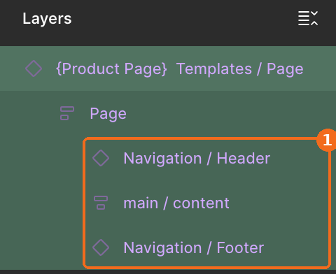
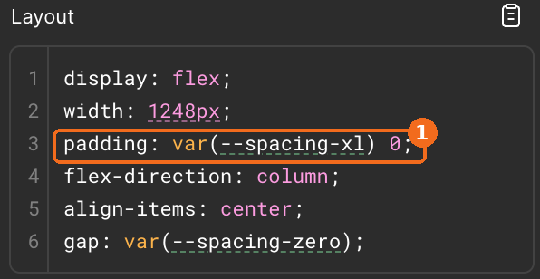
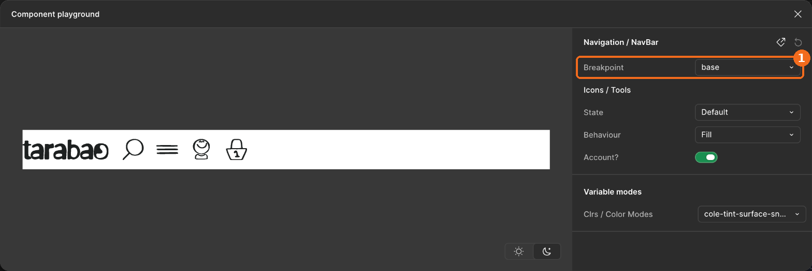
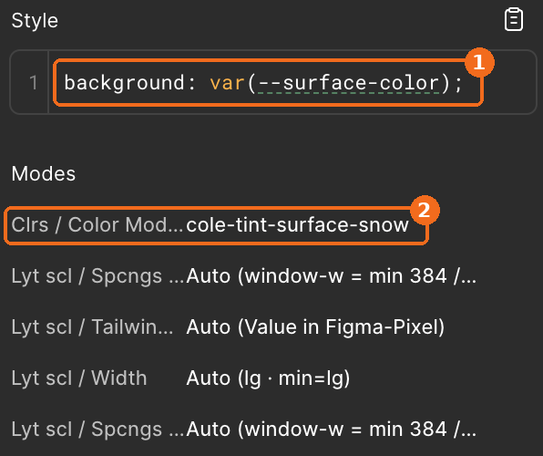

# 2 Tarabao: So fängst Du an

Figma-Datei [B2C und CI](https://www.figma.com/design/rLwATluwV4CSS5rXceLptH/B2C-und-CI?m=dev), Seite COMPONENTS & SCREENS, Dev Mode · Tokens: [`app.tcss`](app.tcss)

Diese Seite zeigt an vier Beispielen, was Du im Dev Mode siehst und wie Du es im Code umsetzt. Jedes Beispiel verweist auf das Kapitel mit den Details.

Klassen stehen immer in zwei Schreibweisen: zuerst die Klasse aus unserem Designsystem (`app.tcss`), dahinter in Klammern die Tailwind-Standardklasse.

---

## 1. So baust Du eine Seite aus Page und Section

Jede Seite ist eine Instanz von `Templates / Page`. Im Layers-Panel siehst Du ihren Aufbau: `Navigation / Header`, `main / content` und `Navigation / Footer` liegen auf einer Ebene. In `main / content` liegen die Sections. Jede Section ist eine Instanz von `Templates / Section`.



① Header, main und Footer sind Geschwister. Der Footer liegt nicht in `main`.

```html
<body class="flex min-h-dvh min-w-content flex-col items-center bg-surface">
  <!-- (min-w-80 md:min-w-182 lg:min-w-246, wenn das Designsystem nicht vollständig aktualisiert worden sein sollte) -->
  <header class="sticky top-0 z-50 w-full bg-surface">…</header>          <!-- Navigation / Header -->
  <main class="flex w-full flex-1 flex-col items-center">                 <!-- main / content -->
    <section class="flex w-full flex-col items-center bg-surface py-xl">  <!-- Templates / Section -->
      <!-- (py-10, wenn das Designsystem nicht vollständig aktualisiert worden sein sollte) -->
      <div class="flex w-full max-w-content flex-col gap-md-l px-md-l">…</div>  <!-- Wrapper [max-w-content] -->
      <!-- (max-w-192 md:max-w-256 lg:max-w-312 gap-5 px-5, wenn das Designsystem nicht vollständig aktualisiert worden sein sollte) -->
    </section>
  </main>
  <footer class="w-full bg-surface py-md-l">…</footer>                    <!-- Navigation / Footer -->
  <!-- (py-5, wenn das Designsystem nicht vollständig aktualisiert worden sein sollte) -->
</body>
```

Mehr dazu: [2.7 Layout](2.7-layout.md) (`Templates / Page`, `Templates / Section`, Slots und Abstände).

---

## 2. So findest Du zu einem Wert im Dev Mode die Klasse

Wähle eine Ebene aus. Im Code-Panel steht der Wert als Variable, hier an `Templates / Section`:



① `padding: var(--spacing-xl) 0;` nennt das Token `--spacing-xl`. Genau diese Zeile steht in `app.tcss` (§4):

```css
--spacing-xl: 2.5rem;     /* 40px */
```

Die Klasse ist die Eigenschaft plus der Token-Name ohne Namespace: `py-xl` (`py-10`, wenn das Designsystem nicht vollständig aktualisiert worden sein sollte).

| Dev Mode | Zeile in `app.tcss` | Klasse |
|---|---|---|
| `padding: var(--spacing-xl) 0` | `--spacing-xl: 2.5rem;` | `py-xl` (`py-10`, wenn das Designsystem nicht vollständig aktualisiert worden sein sollte) |
| `min-width: var(--container-block-min)` | `--container-block-min: 20rem;` | `min-w-block-min` (`min-w-80`, wenn das Designsystem nicht vollständig aktualisiert worden sein sollte) |
| `background: var(--btn-primary-bg)` | `--btn-primary-bg: var(--cole-tint-90);` | `bg-btn-primary-bg` |
| `background: var(--surface-color)` | `--surface-color: var(--warm-white-100);` | `bg-surface` (einzige Ausnahme vom Muster) |

Mehr dazu: [2.3 Dev-Handoff](2.3-tailwind-dev-handoff.md) (Klassen im Markup) und [2.6 Design-Tokens §9.5](2.6-design-tokens-tailwind-v4.md) (Ableitung Figma → CSS).

---

## 3. So liest Du die Optik je Breakpoint aus der Komponente

Wähle eine Komponente aus, z. B. `Navigation / NavBar`. Die Property `viewport-range` ist an die gleichnamige Variable gebunden, die Komponente folgt also dem Breitenbereich der Seite. Klicke auf **Explore component behavior**. Im Component Playground wählst Du unter `viewport-range` base, md oder lg und siehst die Optik je Breitenbereich.



① Hier schaltest Du zwischen base, md und lg um.

Im Code wird daraus eine Komponente ohne Prop für den Breitenbereich. Was sich je Breitenbereich ändert, setzt Du mit `md:` und `lg:`. Breiten schalten über die Token-Klasse selbst um:

```html
<nav class="flex w-full items-center justify-between">
  …
  <div class="hidden md:flex">…</div>              <!-- Ebene mit visible-md-up: erst ab md sichtbar -->
  <div class="min-w-block-min">…</div>             <!-- 320 · 320 · 384 px, schaltet selbst um -->
  <!-- (min-w-80 lg:min-w-96, wenn das Designsystem nicht vollständig aktualisiert worden sein sollte) -->
</nav>
```

Mehr dazu: [2.5 Breakpoints und Width-Variablen](2.5-breakpoints-und-width.md) (Responsivity) und [2.7 Layout](2.7-layout.md).

---

## 4. So liest Du den Farbmodus ab

Wähle eine Ebene aus. Im Code-Panel steht die Farbe als semantische Variable, unter **Modes** steht der Farbmodus:



① `background: var(--surface-color)` ist die Fläche. Ihr Wert hängt vom Farbmodus ab.
② `Clrs / Color Modes` zeigt den Farbmodus, hier `cole-tint-surface-snow`. Steht davor kein „Auto“, ist der Modus an genau dieser Ebene gesetzt. „Auto (…)“ heißt: Der Modus kommt von einer Ebene darüber.

Im Code setzt Du den Farbmodus als `data-theme` an das Element, an dem er in Figma gesetzt ist. Alles darunter erbt ihn:

```html
<header data-theme="cole-tint-surface-snow" class="bg-surface">
  <p class="text-content-text">…</p>
</header>
```

Mehr dazu: [2.1 Farbsystem](2.1-farbsystem.md) (warum es die vier Farbmodi gibt) und [2.3 Dev-Handoff §2–§4](2.3-tailwind-dev-handoff.md) (Code je Farbmodus, Ausnahmen).

---

## In dieser Reihenfolge liest Du Dich ein

| # | Datei | Worum es geht |
|---|---|---|
| 1 | [2.7 Layout](2.7-layout.md) | Page, Section, Slots und Abstände. Hier beginnst Du. |
| 2 | [2.5 Breakpoints und Width](2.5-breakpoints-und-width.md) | Breitenbereiche, Modus an der Section, Breiten und Höhen binden, Breiten im Code |
| 3 | [2.1 Farbsystem](2.1-farbsystem.md) | Themes, die vier Farbmodi und ihre Ausnahmen |
| 4 | [2.3 Dev-Handoff](2.3-tailwind-dev-handoff.md) | Tokens im Markup, Farbmodi im Code |
| 5 | [2.8 Content Modules](2.8-content-modules-und-slots.md) | Slots, Varianten-Achsen und erlaubte Zustände im Playground |
| 6 | [2.2 Komponenten-Liste](2.2-komponenten-liste.md) | alle Komponenten mit Figma-Links und Farbachsen |
| 7 | [2.4 Buttons](2.4-buttons-aufbau.md) | Fill und Hug, Form und Label, Code-Vertrag |
| 8 | [2.9 Content-Struktur](2.9-content-struktur.md) | feste Kategorien und Sammlungen |

## Für die Pflege des Design-Systems

| Datei | Worum es geht |
|---|---|
| [2.6 Design-Tokens](2.6-design-tokens-tailwind-v4.md) | Aufbau von `app.tcss`, Namespaces, Namenskonventionen |
| [`app.tcss`](app.tcss) | alle Tokens, spiegelt die Figma-Variablen 1:1 |
| [token-check/](token-check/) | Abgleich Figma ↔ `app.tcss` (`figma-dump.js`, `token_check.py`) |
| [offene-punkte.md](offene-punkte.md) | offene Entscheidungen |
